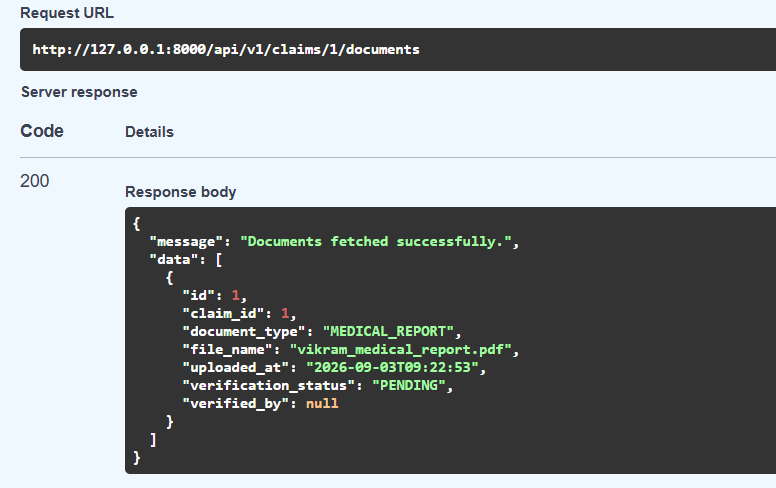

# Architecture Diagram — Insurance Policy & Claim Management System

This shows how a request actually travels through the whole system, layer by
layer, plus how background processing (Celery) and live updates (WebSocket)
fit in. GitHub renders this automatically — no separate image needed.

```mermaid
graph TD
    A["Client<br/>(Swagger UI / Postman / Browser / Mobile App)"]

    subgraph API["API Layer — FastAPI"]
        B["main.py<br/>App entry, CORS, global exception handlers"]
        C["Auth<br/>JWT verification, role-based permission checks"]
        D["Routes<br/>10 routers: auth, customers, plans, policies,<br/>beneficiaries, payments, claims, documents,<br/>settlements, dashboard"]
        W["WebSocket Router<br/>Live claim status connections"]
    end

    subgraph LOGIC["Business Logic Layer"]
        E["Services<br/>business rules, validation, orchestration<br/>(one file per domain area)"]
    end

    subgraph DATA_ACCESS["Data Access Layer"]
        F["Repositories<br/>one per table, raw database CRUD only<br/>no business logic here"]
    end

    subgraph DATA["Data Layer"]
        M["SQLAlchemy Models"]
        G[("SQLite / PostgreSQL<br/>11 tables")]
    end

    subgraph CACHE_BROKER["Redis — one server, three roles"]
        H0[("DB 0 — Cache<br/>customers, plans, policies")]
        H1[("DB 1 — Celery Broker<br/>queued tasks")]
        H2[("DB 2 — Celery Results")]
    end

    subgraph ASYNC["Background Processing"]
        I["Celery Worker<br/>actually sends every email"]
        J["Celery Beat<br/>daily 7am trigger for premium/policy checks"]
        K["app/tasks.py<br/>10 task definitions"]
    end

    subgraph FILES["Generated On-Demand"]
        N["PDF Policy Documents<br/>(ReportLab)"]
        N2["PDF Settlement Letters<br/>(ReportLab)"]
        O["Claim Document Uploads<br/>(validated, saved to disk)"]
    end

    L["SMTP Server<br/>real email delivery"]

    A -->|"HTTP request + JWT bearer token"| B
    B --> C
    C --> D
    D --> E
    E --> F
    F --> M
    M --> G

    E -->|"read / write"| H0
    E -->|".delay(...) queues a task"| H1
    H1 -->|"worker picks up task"| I
    J -->|"wakes up daily, queues task"| H1
    I --> K
    K -->|"send"| L

    E -->|"generate at policy activation"| N
    E -->|"generate at claim settlement"| N2
    E -->|"validate + save at upload"| O

    E -->|"push claim status change"| W
    W <-->|"persistent open connection"| A

    style A fill:#e1f5ff
    style G fill:#fff4e1
    style H0 fill:#ffe1e1
    style H1 fill:#ffe1e1
    style H2 fill:#ffe1e1
    style L fill:#e8ffe1
```

---

## What each layer actually does, in plain words

**Client** — Swagger, Postman, or any real frontend. Sends a normal HTTP
request with a JWT token attached, or opens a WebSocket connection to watch a
specific claim live.

**`main.py`** — the very first thing every request hits. Handles CORS, and
catches any error anywhere in the app, turning it into a clean, consistent
JSON response instead of a raw crash.

**Auth** — checks the JWT token is genuine and not expired, and figures out
which role the person is (Super Admin, Insurance Agent, Claims Officer,
Finance Officer, or Customer) — every route then decides whether that
specific role is allowed in.

**Routes** — the actual URL endpoints (`POST /api/v1/claims/{id}/submit`,
etc.). Their only job is receiving the request and handing it straight to the
matching service — no real logic lives here.

**Services** — this is where the actual thinking happens: every business rule
in this whole project (age eligibility, coverage-vs-premium, incident-date
validation, beneficiary percentage protection, settlement ceiling checks)
lives here.

**Repositories** — the layer whose *only* job is talking to the database —
fetch a row, save a row. No business rules, no validation, nothing else.

**Models** — the SQLAlchemy classes describing what each table actually looks
like.

**Redis, one server, three separate jobs** — genuinely one Redis server, just
using 3 of its built-in numbered storage slots: caching reads, holding
Celery's task queue, and holding Celery's task results — kept separate so they
never interfere with each other.

**Celery Worker** — the process that actually sends every real email in this
system. Nothing sends automatically without this process running.

**Celery Beat** — a scheduler that wakes up once a day and checks for
premiums due soon, premiums overdue, and policies expiring soon — the one
notification path in this whole project that isn't triggered by a person
doing something, but by the clock.

**PDF generation and file uploads** — happen synchronously, directly inside
the request itself (not through Celery), the moment a policy activates, a
claim settles, or a document is uploaded — fast enough that there's no need
to queue them.

**WebSocket** — a separate, persistent connection type from normal requests.
Once a client opens one and "subscribes" to a specific claim, the server
pushes updates to it live, the instant that claim's status actually changes
elsewhere in the system (submit, approve, reject, or settle) — no polling, no
refreshing needed.

---

## A concrete example — what happens when a claim gets approved

1. Claims Officer calls `POST /claims/{claim_id}/approve`
2. **Routes** hands this straight to **Services**
3. **`claim_service`** checks the claim is genuinely in `SUBMITTED` or
   `UNDER_REVIEW`, checks every attached document has been marked `VERIFIED`
   (through the **Repository**, from the **Database**)
4. If all checks pass: flips the claim's status to `APPROVED`, saves it
5. An approval email gets queued into **Redis (DB 1)**
6. A live status update gets pushed through the **WebSocket** connection, if
   anyone happens to be watching this specific claim
7. The API responds to the Claims Officer **immediately** — it doesn't wait
   for the email to actually send
8. Moments later, the **Celery Worker**, running as a completely separate
   process, picks up the queued email task and actually sends it through the
   real **SMTP server**

## How to view this diagram

- **On GitHub:** opens automatically when viewing this file in your
  repository
- **Locally:** paste the code block into [mermaid.live](https://mermaid.live)
  to preview or export it as an image