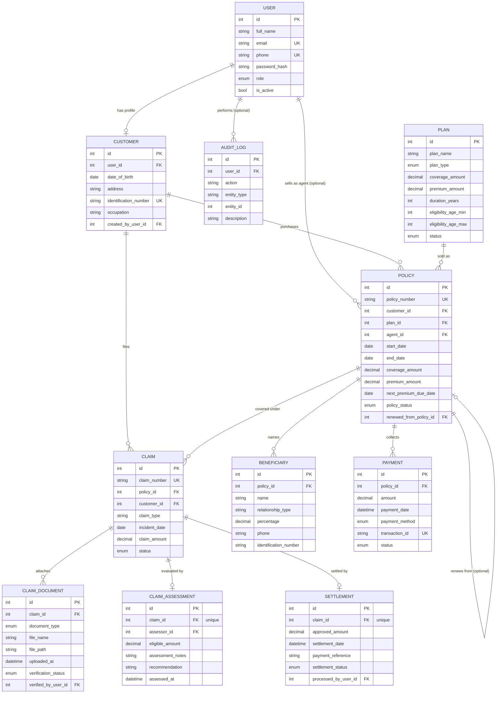

# ER Diagram — Insurance Policy & Claim Management System

This diagram shows all 11 tables and how they connect. GitHub renders this
automatically when viewing this file in a repository — no separate image or
tool needed. Full field lists for every table are in `app/models/` and the
Alembic migration file.

---

## Relationships explained 

- **One User can have one Customer profile** — the only role in this project
  with real extra fields beyond a login account. Insurance Agent, Claims
  Officer, and Finance Officer stay flat login accounts.
- **One User (an Insurance Agent) can sell many Policies** — but a Policy's
  `agent_id` is optional, so this survives even if an agent's account is later
  removed.
- **One Customer can purchase many Policies and file many Claims.**
- **One Plan can be sold as many Policies** over time — but each Policy locks
  in its own `coverage_amount`/`premium_amount` at the moment of purchase, so
  changing the Plan afterward never silently affects existing policyholders.
- **One Policy branches into several things:** many Beneficiaries (who must
  together total exactly 100%), many Payments, many Claims, and optionally
  points back to the **older Policy it was renewed from** — the one
  genuinely self-referencing relationship in this whole schema.
- **One Claim branches into three things, each with a different shape:** many
  Documents (a real list), at most **one** Assessment, and at most **one**
  Settlement (both enforced by a real `unique=True` constraint on `claim_id`,
  not just application logic).
- **Audit Log entries optionally point back to whichever User performed the
  action** — optional because the log entry should still exist even if that
  user's account is later removed.

## How to view this diagram

- **On GitHub:** just open this file in your repository — it renders
  automatically, no setup needed.
- **Locally, before pushing:** paste the code block above (without the triple
  backticks) into [mermaid.live](https://mermaid.live) to preview it instantly.